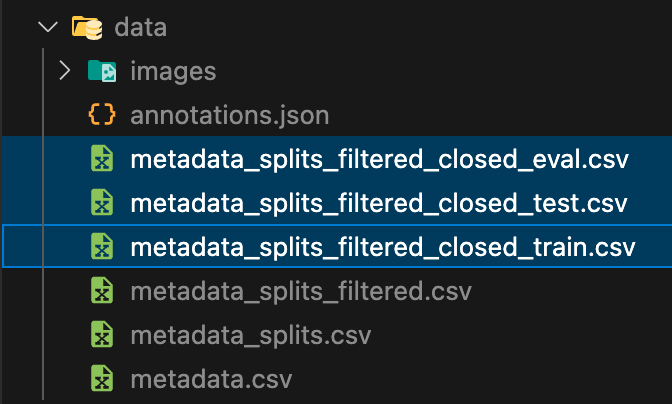

# SeaTurtle-ReID

Implement the highest performance baseline model (ArcFace, Swim-B on full image) for closed-set Sea Turtle Individual Re-Identification, from [the paper](https://arxiv.org/abs/2211.10307).

## Setup

1. Download and extract data from [SeaTurtleID2022](https://www.kaggle.com/datasets/wildlifedatasets/seaturtleid2022/data)
2. Copy only relate files and folders as following to `data` folder
   
3. Open [notebooks/00 - Preparation.ipynb](./notebooks/00%20-%20Preparation.ipynb) and run all script to create smaller dataset for reducing time during implementation purpose. The ouput will be a new files as following.
   

## Resource Links

### Original papers

- [SeaTurtleID2022: A long-span dataset for reliable sea turtle re-identification](https://arxiv.org/abs/2211.10307)
- [ArcFace: Additive Angular Margin Loss for Deep Face Recognition](https://arxiv.org/abs/1801.07698)

### Source codes

- [arcface-pytorch](https://github.com/ronghuaiyang/arcface-pytorch)
- [Swin-B (pytorch docs)](https://docs.pytorch.org/vision/main/models/generated/torchvision.models.swin_b.html#torchvision.models.swin_b)
- [Swin-Transformer (Microsoft github)](https://github.com/microsoft/Swin-Transformer)
<!-- - [FaceNet: A Unified Embedding for Face Recognition and Clustering](https://arxiv.org/abs/1503.03832) -->
